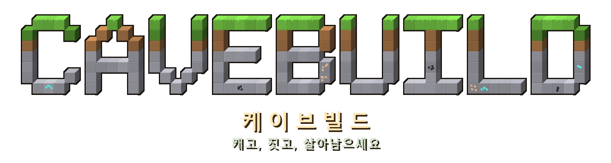

  

  <b><a href="https://korean568.github.io/cavebuild/">▶ 바로 플레이하기</a></b> 
  캐고, 짓고, 살아남으세요

---

브라우저에서 바로 돌아가는 3D 복셀 생존·건축 게임입니다.
**파일 하나(`index.html`)에 전부 들어 있고**, 텍스처·3D 모델·효과음까지 모두 코드로 만들어냅니다. 외부 그림이나 소리 파일이 없어요.

## 무엇을 하는 게임인가요

낮에는 나무를 베어 도구를 만들고, 땅을 파 광석을 캐고, 집을 짓습니다.
밤이 오면 좀비와 명사수 해골이 나타나니 등불을 켜고 침대에서 밤을 넘기세요.
철·수정·블레이즈스톤으로 장비를 갖추면 세 개의 다른 차원으로 가는 문이 열립니다.

| 차원 | 가는 법 | 기다리는 것 |
|---|---|---|
| **어비스** | 흑요석 10~14개로 4×5 틀 세우기 | 깊은 곳의 **판데모니움**, 불멸의 악마 |
| **네크로폴리스** | 지하 폐허 마을의 거대한 차원문 | **다크가디언** |
| **호라이즌** | 표식 돌 방에 포탈 열쇠 12개 꽂기 | **엔딩드래곤** (쓰러뜨리면 엔딩) |

## 조작

**PC** — `WASD` 이동 · `스페이스` 점프/수영 · `Shift` 달리기 · `C` 웅크리기 · `P` 시점 변경
`좌클릭` 공격 (한 번씩 누르기) · `좌클릭 누르고 있기` 블록 캐기 · `우클릭` 설치/먹기/사용/거래
`1~9`·휠 아이템 선택 · `E` 인벤토리 & 제작 · `Q` 버리기 · `Esc` 일시정지

**모바일** — 왼쪽 화면 조이스틱으로 이동, 오른쪽 화면 드래그로 시점, 화면 버튼으로 캐기·설치·점프

## 특징

- **세계는 무한** — 지형·동굴·광맥·마을·차원문이 시드에서 만들어집니다
- **마을과 주민** — 다섯 직업의 주민과 동전으로 거래, 빌리저 가디언이 마을을 지킵니다
- **보관과 자동화** — 상자, 그리고 떨어진 아이템을 빨아들여 아래 상자로 보내는 호퍼
- **자동 저장** — 브라우저에 저장되고, 저장 파일로 내보내 다른 기기로 옮길 수 있어요
- **백그라운드 워커** — 지형 생성과 메시 계산을 따로 돌려 끊김을 줄였습니다

## 저장 파일

세계는 브라우저(IndexedDB)에 저장됩니다. 다른 기기로 옮기려면
일시정지 → **저장 파일 내보내기** → 받은 `cavebuild-save.json`을 타이틀에서 **저장 파일 불러오기**.

---

three.js r128만 외부에서 불러오고, 나머지는 전부 이 파일 안에 있습니다.
